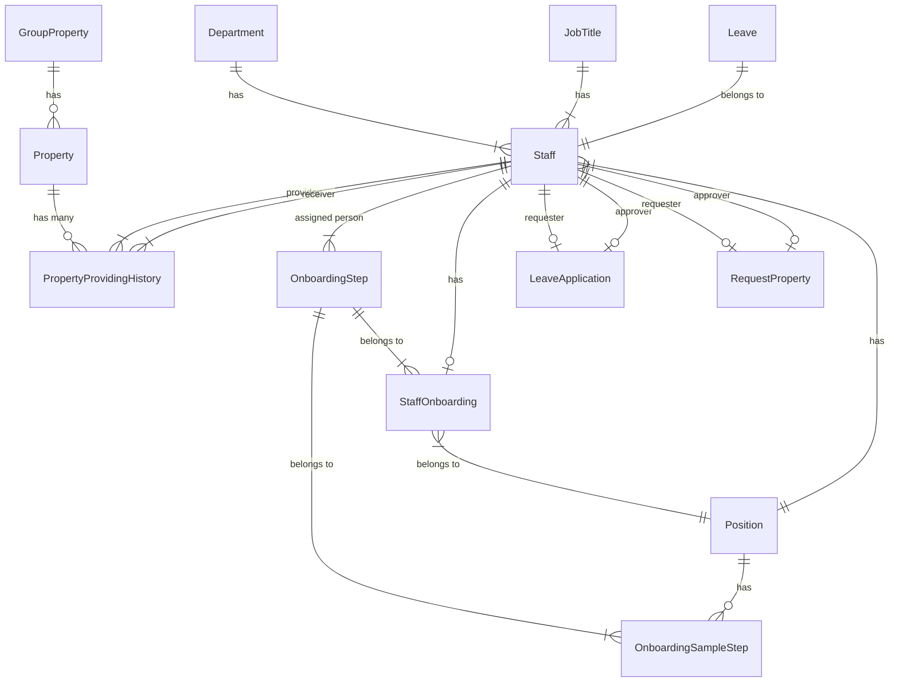

# HRM(Human Resource Management)

## SET UP

### Database - Instasll Postgres

    sudo apt update
    sudo apt install postgresql postgresql-contrib

### BackEnd(Ruby on Rails)

You'll need to install `Ruby 3.0.0` in order to use Investglass within `Rails 6.1.7`
- `Note` : Recommend ubuntu or macOS system
- Take the step below to get set :

**1. Install RVM You can follow the instruction over [this page](https://www.digitalocean.com/community/tutorials/how-to-install-ruby-on-rails-with-rvm-on-ubuntu-20-04).**

**Step 1 – Installing RVM with the Latest Rails**

First, you’ll need to install or update GPG (GNU Privacy Guard) to the most recent version in order to contact a public key server and request a key associated with the given ID:

    sudo apt update
    sudo apt install gnupg2

Next, you’ll request the RVM project’s public key to verify the legitimacy of your download:

    gpg2 --keyserver hkp://keyserver.ubuntu.com --recv-keys 409B6B1796C275462A1703113804BB82D39DC0E3 7D2BAF1CF37B13E2069D6956105BD0E739499BDB

You’ll use the curl command to download the RVM installation script from the project’s website:

    \curl -sSL https://get.rvm.io -o rvm.sh

Once it is downloaded, if you would like to audit the contents of the script before applying it, run:

    nano rvm.sh

Now, you can pipe it to bash to install the latest stable Rails version which will also pull in the associated latest stable release of Ruby.

    cat rvm.sh | bash -s stable --rails

When the installation is complete, source the RVM scripts from the directory they were installed:

    source ~/.rvm/scripts/rvm

**Step 2 – Installing and Using Specific Ruby or Rails Versions**

Install the specific version of Ruby that you need through RVM, replacing the highlighted version number with your version of choice, such as ruby-3.0.0 or just 3.0.0:

    rvm install 3.0.0

`Work around`: If you have problem in installing ruby 3.0.0 version. Follow the step below to get set, this step can be a little tricky depend on your local environment and OS, in anycase, you'll have to use OpenSSL version 1 to achieve to install ruby 3.0.0 version without any bugs.

    rvm pkg install openssl
    rvm remove 3.0.0
    rvm install 3.0.0 --with-openssl-dir=$rvm_path/usr

When this is done you shall achieve to make a successfull `bundle install` :

    cd ~/Assignment/Backend
    rvm use 3.0.0
    bundle install
    
**2. Add database config and database setup**

- Add database config in file `config/database.yml`:

    ```
    devlopment:
      <<: *default
      database: <%= ENV['DATABASE'] %>
      username: <%= ENV['USERNAME_DB'] %>
      password: <%= ENV['PASSWORD_DB'] %>
      host: <%= ENV['HOST'] %>
      port: <%= ENV['PORT'] %>
    ```
      
- Database setup in rails

    Create database:
    
        bundle exec rake db:create
        
    Create table in database:
    
        bundle exec rake db:migrate

    Create fake data in database
    
        bundle exec rake db:seed
        
### FrontEnd(ReactJs) - Install NodeJS and npm package

You should consider using the LTS version of NodeJS, but you can be sure it gonna work using `v16.13.2`

- Install NVM:
```    
wget -qO- https://raw.githubusercontent.com/nvm-sh/nvm/v0.39.1/install.sh | bash
```
        
- Install NodeJS:
```
nvm install 16
```

- Install dependencies
```
cd ~/Assignment/Frontend
npm install 
```

## Run Project

- rails s (with port 3000)
- npm start (with port 3001)
- account test:
```
email: admin@gmail.com
pass: Levantung123@
```

## Database diagram


