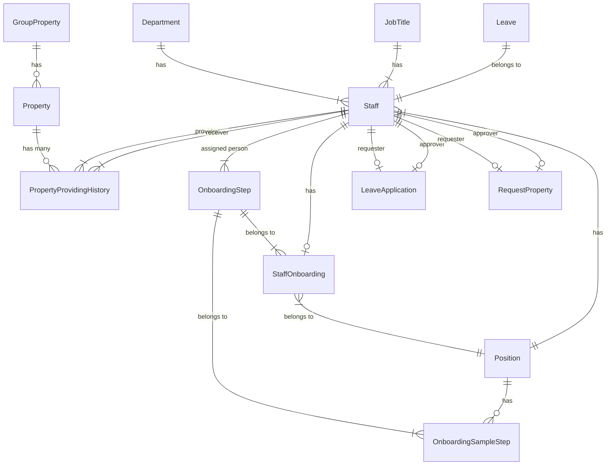

# HRM(Human Resource Management)

# SET UP

## FrontEnd - ReactJs

- npm/yarn install

## BackEnd - Ruby on Rails

- Ruby 3.0.0
- Rails 6.1.7
- install postgres
- bundle install
- setup password database for postgres
- rails db:create
- rails db:migrate
- rails db:seed ( create data )

## Run Project

- rails s (with port 3000)
- npm start (with port 3001)
- account test: 
    email: admin@gmail.com
    pass: Levantung123@

